
<h1 align="center">基于Java的药店药品信息管理系统的设计与实现+vue</h1>

## 简介
药店药品信息管理系统：角色分为管理员、员工；功能包括药品管理、供应商管理、进货管理、销售统计、用户中心等模块，支持搜索、筛选、统计报表导出等操作。    --计算机毕业设计源码；毕设源码；java毕业设计源码

## 联系方式

<h3 align="center">获取完整代码与数据库文件 + 微信：bysj5151 QQ: 86050149 QQ群: 783742310</h3>

<h3 align="center">可帮忙远程部署 包运行成功！提供远程部署、修改代码、设计文档指导、代码讲解等服务！</h3>

## 功能介绍（完整见运行截图）
管理员：管理员负责系统的整体运行和监控，包括添加和管理用户、角色分配等。可以通过导航栏访问供应商管理、药品管理、进货管理、销售管理和员工管理等模块，支持药品信息录入、编辑和审核等操作。管理员具有全面的药品管理权限，包括库存调整、进货审批和销售统计。此外，管理员能够对系统功能进行配置和优化以提升管理效率。

药剂师：药剂师的主要职责是管理药品库存和核对药品信息。他们可以通过系统查看药品的详细信息，包括供应商、编号、名称、类型、进价和库存情况等。药剂师还可以进行药品的进货登记和库存盘点，以确保药品供应的准确性和及时性。同时，他们可以对药品的销售数据进行分析，帮助优化采购计划。

店员：店员负责协助药品的销售和基本库存管理，通过系统查看药品信息以及了解库存和价格变化。虽然店员无权直接对药品信息进行修改，但他们可以通过界面查看药品的效期状态和功效信息，以便向顾客提供准确的信息支持。店员也可以展示和介绍药品的促销活动，根据系统提示为客户提供个性化服务。

普通用户：普通用户主要用于系统的登录和查看功能，具有限定权限来确保操作的安全性。他们可以通过搜索功能查询特定药品的信息，包括药品的名称、功效和图片等。普通用户可以在系统中记录和查看已购药品的历史订单，还可以通过个人中心查看账户信息和修改密码。在用户中心提供意见反馈，提高系统的用户体验和功能完善。

## 运行截图
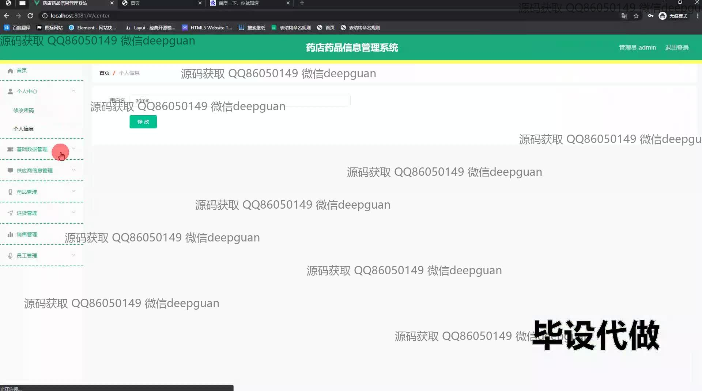
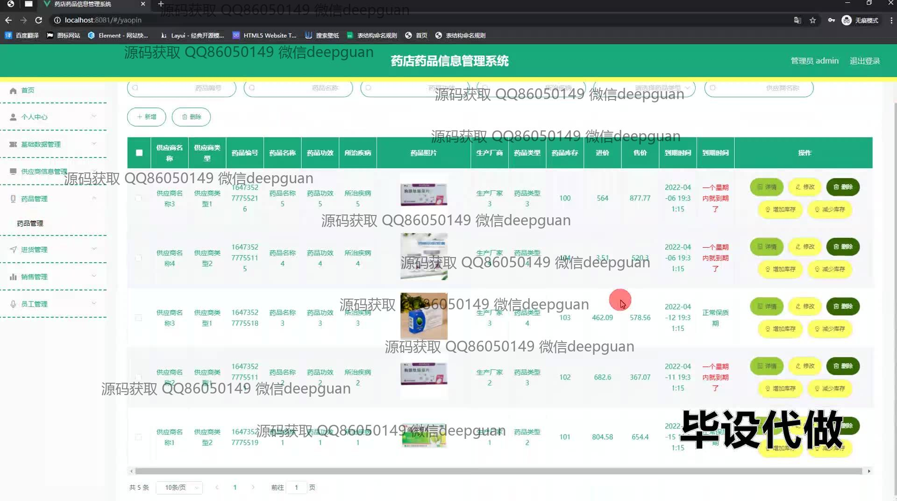
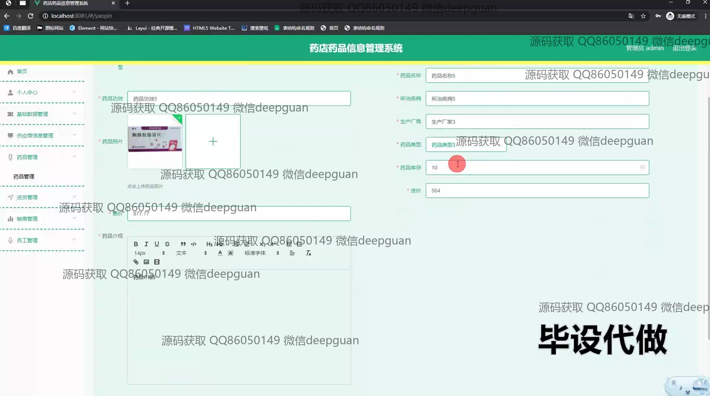
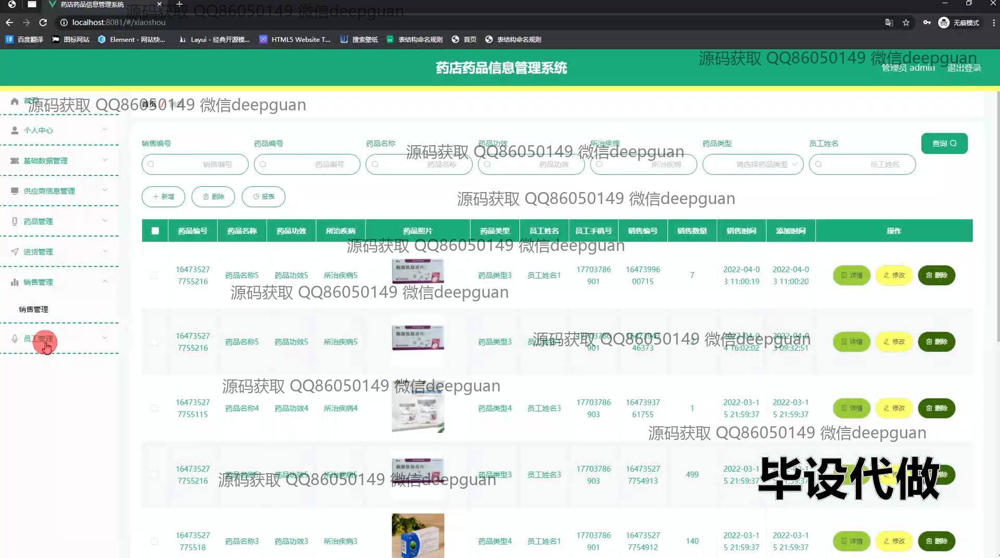
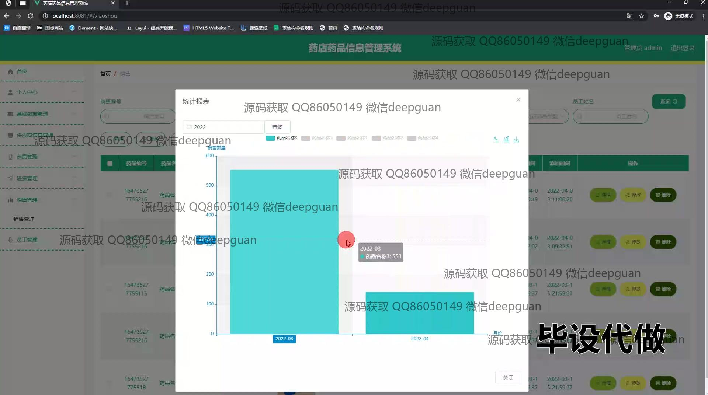
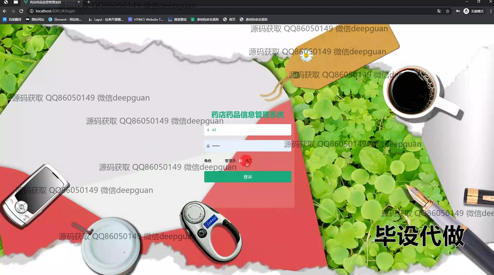
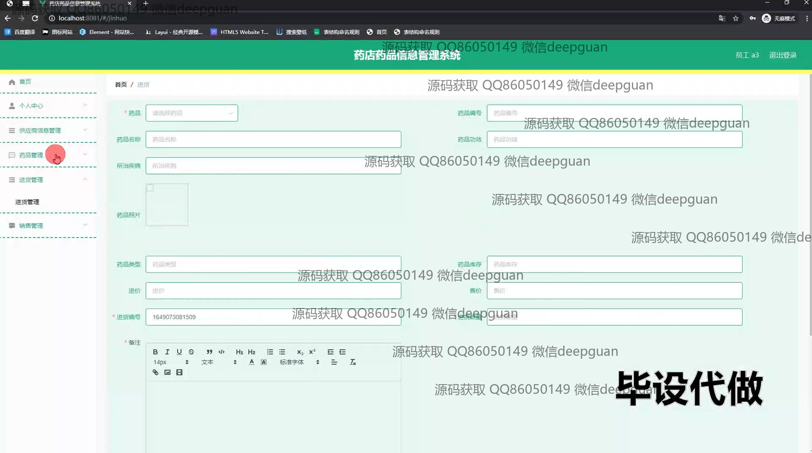
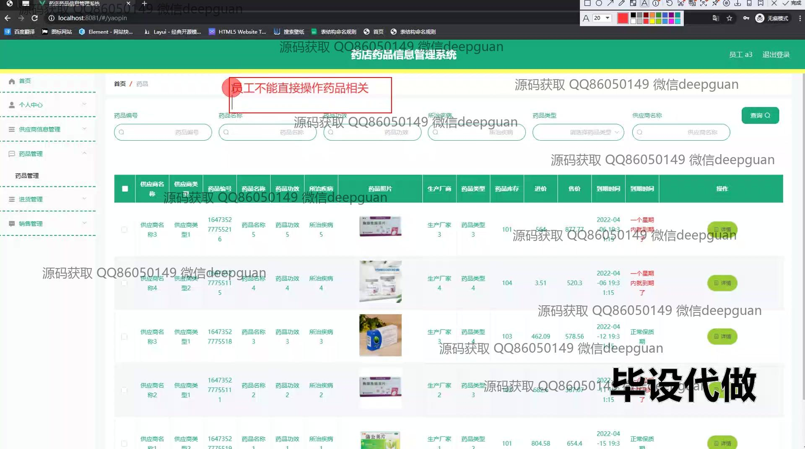
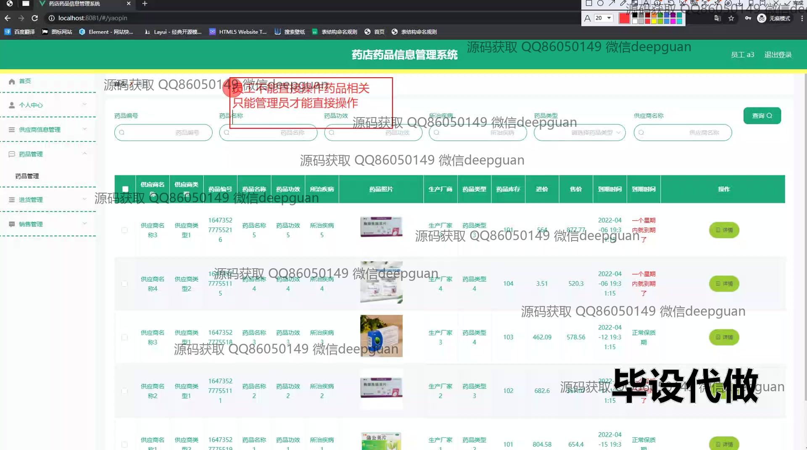
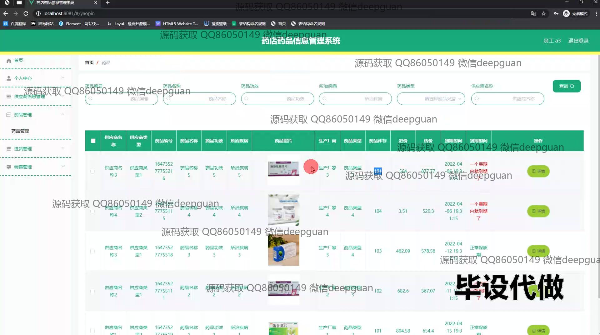
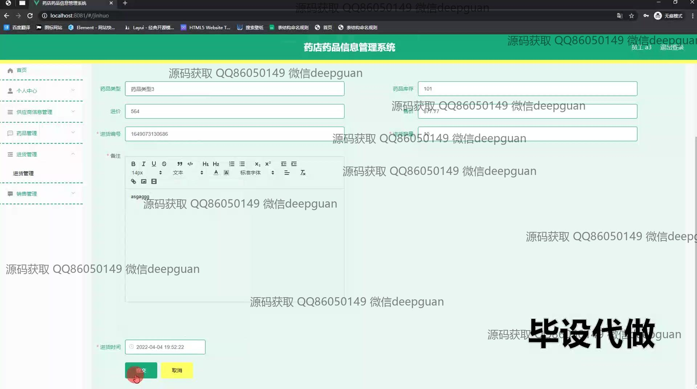
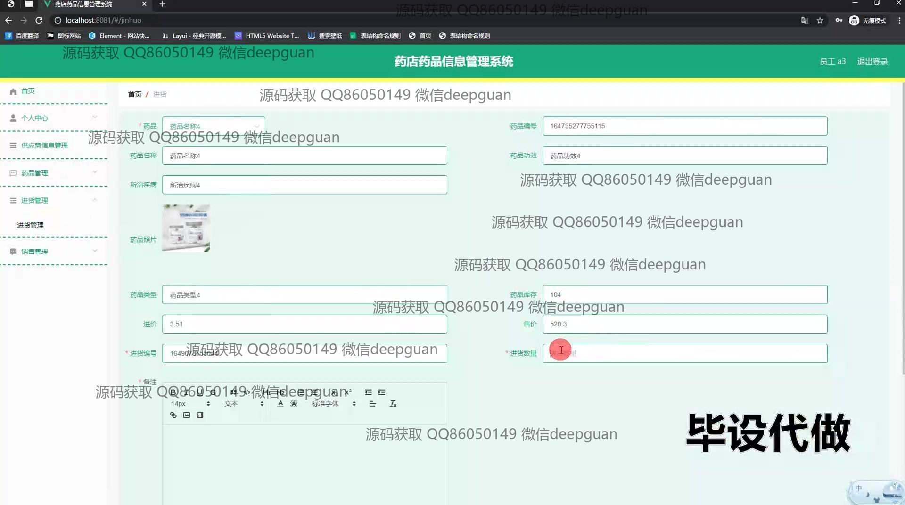
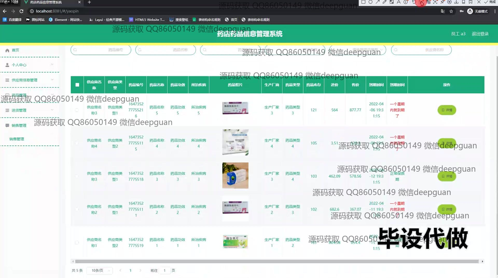
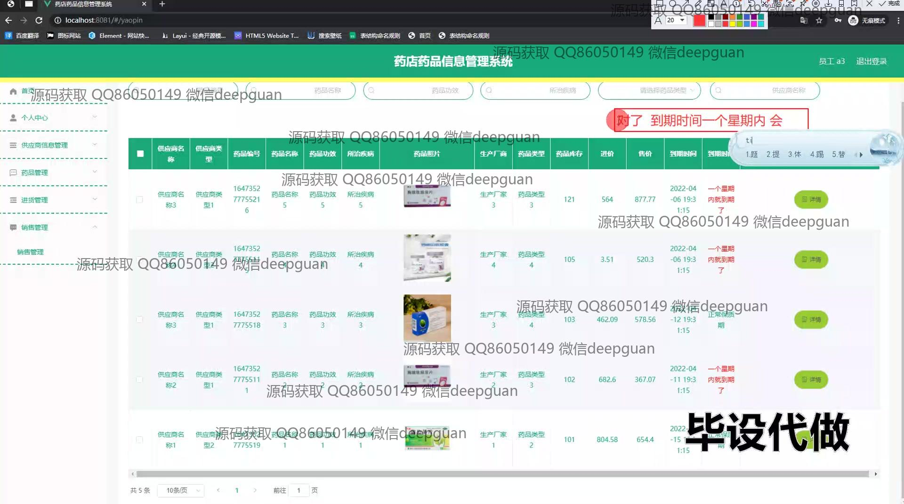
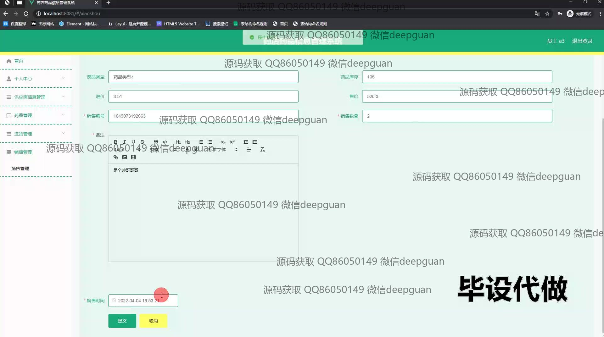
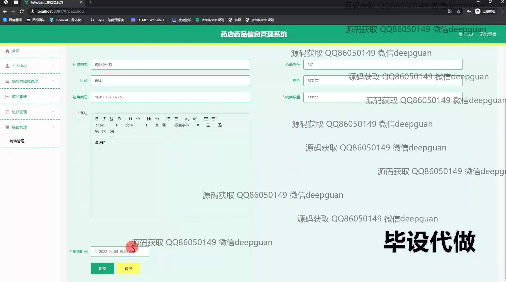

本代码来源于网络,仅供学习参考使用!

